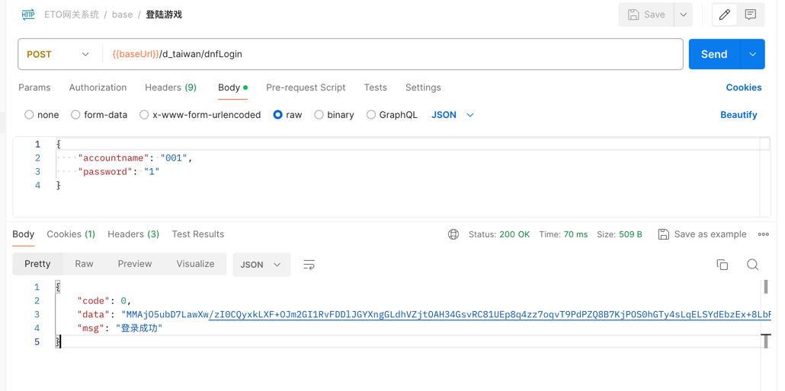

# ETO·网关服务

[](https://opensource.org/licenses/Apache)
[](https://golang.dev/)


```shell
# 配置文件 将eto.config.yaml 重命名为config.yaml 并修改配置文件为你的配置
mv eto.config.yaml config.yaml


# mod 包管理
go mod tidy

# 编译
go build -o eto-gateway

# 运行
./eto-gateway

# 如果你的服务正常运行，你可以通过curl访问登陆接口测试 post 请求 body 为json格式 {"accountname":"","password":""}
curl -X POST http://localhost:8080/login -d '{"accountname":"admin","password":"admin"}' -H "Content-Type: application/json"

# 获取到的数据中 data 为游戏token base64编码后的数据
```

##### 成功返回结果
```json
{
    "code": 0,
    "data": "MMAjO5ubD7LawXw/....",
    "msg": "登录成功"
}
```
##### 


## 交流群
```shell
QQ群： 575053531
```


## 如果你觉得这个项目对你有帮助，你可以请我喝杯咖啡：
[](resource/byte_money.jpg)